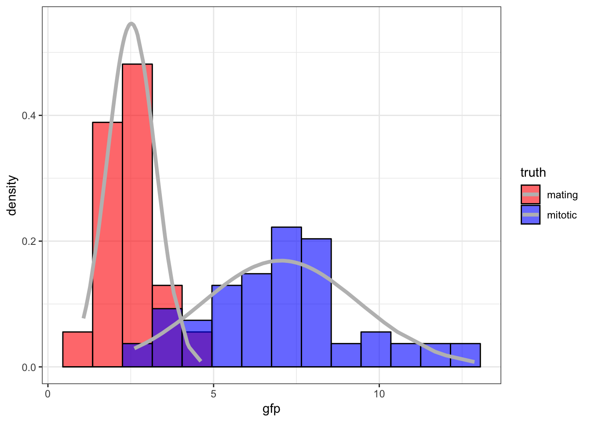
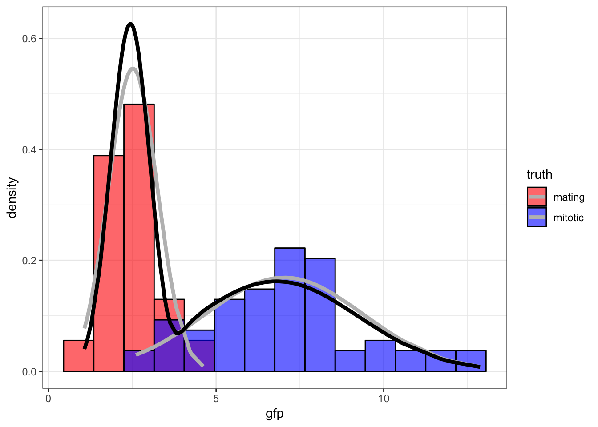

\providecommand{\E}{\operatorname{E}}
\providecommand{\V}{\operatorname{Var}}
\providecommand{\Cov}{\operatorname{Cov}}
\providecommand{\se}{\operatorname{se}}
\providecommand{\logit}{\operatorname{logit}}
\providecommand{\iid}{\; \stackrel{\text{iid}}{\sim}\;}
\providecommand{\asim}{\; \stackrel{.}{\sim}\;}
\providecommand{\xs}{x_1, x_2, \ldots, x_n}
\providecommand{\Xs}{X_1, X_2, \ldots, X_n}
\providecommand{\bB}{\boldsymbol{B}}
\providecommand{\bb}{\boldsymbol{\beta}}
\providecommand{\bx}{\boldsymbol{x}}
\providecommand{\bX}{\boldsymbol{X}}
\providecommand{\by}{\boldsymbol{y}}
\providecommand{\bY}{\boldsymbol{Y}}
\providecommand{\bz}{\boldsymbol{z}}
\providecommand{\bZ}{\boldsymbol{Z}}
\providecommand{\be}{\boldsymbol{e}}
\providecommand{\bE}{\boldsymbol{E}}
\providecommand{\bs}{\boldsymbol{s}}
\providecommand{\bS}{\boldsymbol{S}}
\providecommand{\bP}{\boldsymbol{P}}
\providecommand{\bI}{\boldsymbol{I}}
\providecommand{\bD}{\boldsymbol{D}}
\providecommand{\bd}{\boldsymbol{d}}
\providecommand{\bW}{\boldsymbol{W}}
\providecommand{\bw}{\boldsymbol{w}}
\providecommand{\bM}{\boldsymbol{M}}
\providecommand{\bPhi}{\boldsymbol{\Phi}}
\providecommand{\bphi}{\boldsymbol{\phi}}
\providecommand{\bN}{\boldsymbol{N}}
\providecommand{\bR}{\boldsymbol{R}}
\providecommand{\bu}{\boldsymbol{u}}
\providecommand{\bU}{\boldsymbol{U}}
\providecommand{\bv}{\boldsymbol{v}}
\providecommand{\bV}{\boldsymbol{V}}
\providecommand{\bO}{\boldsymbol{0}}
\providecommand{\bOmega}{\boldsymbol{\Omega}}
\providecommand{\bLambda}{\boldsymbol{\Lambda}}
\providecommand{\bSig}{\boldsymbol{\Sigma}}
\providecommand{\bSigma}{\boldsymbol{\Sigma}}
\providecommand{\bt}{\boldsymbol{\theta}}
\providecommand{\bT}{\boldsymbol{\Theta}}
\providecommand{\bpi}{\boldsymbol{\pi}}
\providecommand{\argmax}{\text{argmax}}
\providecommand{\KL}{\text{KL}}
\providecommand{\fdr}{\text{FDR}}
\providecommand{\pfdr}{{\rm pFDR}}
\providecommand{\mfdr}{{\rm mFDR}}
\providecommand{\bh}{\hat}
\providecommand{\dd}{\lambda}
\providecommand{\q}{\operatorname{q}}

```{r, message=FALSE, echo=FALSE, cache=FALSE}
# this makes the R output formatted the same as Foundations of Applied Statistics
source("https://raw.githubusercontent.com/jdstorey/fas/master/customization/knitr_options.R")
# load libraries used in this chunk
library(gapminder) 
```


## Summary
In week 6, we continued our discussion on Bayesian Estimation and classificaiton, different ways of doing priors, numerical methods and likihood; and the following concepts are discussed: 

- Bayesian Estimation
    - Posterier Distribution
    - Posterior Expection
    - Posterior Intervals
    - Maximum a posteriori Probability
    - Loss Function
    - Bayes Risk
    - Bayes Estimation

- Bayes Classification
    - Posterior Probability
    - loss Function
    - Bayes Risk
    - Bayes Rule

- Priors
    - Conjugate Priors
    - Jeffreys Prior
    - Improper Prior

- Empirical Bayes 

- Numerical methods
    - Latent varibale models, EM models
    - Markov chain Monte Carlo

## Estimation
Bayesian estimation is an anolog of point estimation, such as posterior expectation, posterior median, MAP,etc. 

### Posterier distribution
Assume we have $(X_1, X_2, \ldots, X_n) | \theta \ \iid \ F_{\theta}$ with prior distribution $\theta \sim F_{\tau}$
The posterior distribution of $\theta | \boldsymbol{X}$ is obtained through Bayes theorem:

$$
f(\theta | \boldsymbol{X}) = \frac{f(\boldsymbol{X} | \theta) f(\theta)}{f(\boldsymbol{X})} = \frac{f(\boldsymbol{X} | \theta) f(\theta)}{\int f(\boldsymbol{X} | \theta^*) f(\theta^*) d\theta^*}  \propto L(\theta ; \boldsymbol{x}) f(\theta)
$$

Note $\boldsymbol{X}$ is bold and capital, representing r.v. Now $\theta$ is a random variable, so we write in term of $f(\boldsymbol{X} | \theta).$ Here we use a condensed notation (not writing $\tau$). $f(\boldsymbol{X})$ is the mariginal pdf or pmf of the data.  The denominator is what usually difficult to calculate. This posterior pdf  $\propto L(\theta ; \boldsymbol{x}) f(\theta)$ because 1. $f(\boldsymbol{X | \theta})$ is the likihood function and 2. the marginal on the denominator is not a function of $\theta$. 

### Posterior Expectation
Once we havce the posterior pdf or pmf, we can do any probablity calcualtion we want. The the posterior expected value is: 
  

\begin{align}
\operatorname{E}[\theta | \boldsymbol{x}]  & = \int \theta f(\theta | \boldsymbol{x}) d\theta \\
& = \frac{\int \theta L(\theta ; \boldsymbol{x}) f(\theta) d\theta}{\int L(\theta ; \boldsymbol{x}) f(\theta) d\theta}
\end{align}

  
Equation $2$ is got from substiting the Posterier distribution $f(\theta | \boldsymbol{x})$ in and $f(x)$ cancels out eventually. This is equivalent to the motivating example from last week. 

### Posterior Interval
A Bayesian analog of the confidence interval: an interval within which the parameter of interest falls within. This is straight probability calculation. Note $\theta$ is posterior distribution conditioned on $\boldsymbol{x}$
  
$$
  1-\alpha = \Pr(C_\ell \leq \theta \leq C_u | \boldsymbol{x})
$$

### Maximum *A Posteriori* Probability (MAP)
  This is maximum likihood analog. We are maimizing the likihood times the prior (weighting) over $\theta$. 

$$
\begin{aligned}
\hat{\theta}_{\text{MAP}} & = \operatorname{argmax}_\theta \Pr(\theta | \boldsymbol{x})f(\theta) \\
& = \operatorname{argmax}_\theta L(\theta ; \boldsymbol{x}) f(\theta)
\end{aligned}
$$
Note for many machine learning settings, if there are infinite amount of data $f(\theta)$ peaks to a true value. 

### Loss functions (Error in estimate)
Let $\mathcal{L}\left(\theta, \tilde{\theta}\right)$ be the loss function for a given estimator $\tilde{\theta}$.We can have for example squared error loss or absolute error loss:
  
$$
\mathcal{L}\left(\theta, \tilde{\theta}\right) = \left(\theta - \tilde{\theta}\right)^2 \mbox{ or } 
\mathcal{L}\left(\theta, \tilde{\theta}\right) = \left|\theta - \tilde{\theta}\right|.
$$
Fields like social sciences and economics commonly use loss functions.
$$
\begin{aligned}
\operatorname{E}\left[\left(\theta - \tilde{\theta}\right)^2\right] & = \left(\operatorname{E}\left[\tilde{\theta}\right] - \theta\right)^2 + \operatorname{Var}\left(\tilde{\theta}\right) \\
& = \mbox{bias}^2 + \mbox{variance}
\end{aligned}
$$
Let's work through how we get the result:

$$
\begin{aligned}
\operatorname{E}\left[\left(\theta - \tilde{\theta}\right)^2\right] & = \operatorname{E}\left[\left(\theta^2-2\theta\tilde{\theta}+\tilde{\theta}^2 \right)\right]\\
&= \theta^2 -2\theta\operatorname{E}[\tilde{\theta}]+\operatorname{E}[\tilde{\theta}^2]\\
&=\operatorname{E}[\tilde{\theta}]^2+ \theta^2 -2\theta\operatorname{E}[\tilde{\theta}]+\operatorname{E}[\tilde{\theta}^2]-\operatorname{E}[\tilde{\theta}]^2\\
&= \left(\operatorname{E}\left[\tilde{\theta}\right] - \theta\right)^2 + \operatorname{Var}\left(\tilde{\theta}\right)
\end{aligned}
$$

### Bayes Risk

The **Bayes risk**, $R\left(\theta, \tilde{\theta}\right)$, is the expected loss with respect to the posterior:

$$
\E\left[ \left. \mathcal{L}\left(\theta, \tilde{\theta}\right) \right| \boldsymbol{x} \right]
= \int \mathcal{L}\left(\theta, \tilde{\theta}\right) f(\theta | \boldsymbol{x}) d\theta
$$
The intergral is taken over the posterior distribution $\theta | \boldsymbol{x}$. What we have here is that we first conditioned on observed data $\boldsymbol{x}$, and then do the probability calculation. Note both $\theta$ and $\tilde{\theta}$ are conditioned on data.

### Bayes Estimators
Once we have Bayes risk from loss function, we can calculate Bayes Estimators to  minimize the Bayes risk. 
Note everything is in finite sample size, $n$ is not going to $\infty$. The challenge is what the prior distribution is, which we will discuss more in details.

The posterior expectation $\E\left[ \left. \theta \right| \boldsymbol{x} \right]$ minimizes the Bayes risk of $\mathcal{L}\left(\theta, \tilde{\theta}\right) = \left(\theta - \tilde{\theta}\right)^2$ (squared loss).

The posterior median of $f(\theta | \boldsymbol{x})$, calculated by $F^{-1}_{\theta | \boldsymbol{x}}(1/2)$, minimizes the Bayes risk of $\mathcal{L}\left(\theta, \tilde{\theta}\right) = \left|\theta - \tilde{\theta}\right|$ (absolute loss).


## Bayes Classification
Bayes classification is an analog of hypothesis testing. The **Neyman-Pearson Lemma**  and **Generalized LRT** we covered before have a direct anaolog in baysesian inference. Typically we deal with composite hypothesis where ther are more than one value in each hypothesis.

We will set up a composite vs. composite in the following section. 

### Assumptions

Let $(X_1, X_2, \ldots, X_n) | \theta \iid F_\theta$ where $\theta \in \Theta$ and $\theta \sim F_{\tau}$.  Let $\Theta_0, \Theta_1 \subseteq \Theta$ so that $\Theta_0 \cap \Theta_1 = \varnothing$ and $\Theta_0 \cup \Theta_1 = \Theta$.

Given observed data $\boldsymbol{x}$, we wish to classify whether $\theta \in \Theta_0$ or $\theta \in \Theta_1$.  

The null hypothesis is  $\theta \in \Theta_0$ and the alternative hypotehsis is $\theta \in \Theta_1$.

### Prior Probability on *H*
Let $H$ be a rv such that $H=0$ when $\theta \in \Theta_0$ and $H=1$ when $\theta \in \Theta_1$.

From the prior distribution on $\theta$, we can calculate 

$$
\Pr(H=0) = \int_{\theta \in \Theta_0} f(\theta) d\theta
$$ 

and $\Pr(H=1) = 1-\Pr(H=0)$.  

A critisium for the Bayesian is that they often think parameters as a interval instead of a single value. From the Null hypothesis significance testing (NHST), it's not reasonable to have a simple null phypothesis. One exception that's toally scientific is genetics mapping where we consider if the recombination is $1/2$ or less than $1/2$. 

###  Posterior Probability
Using Bayes theorem, we can also calculate

$$
\begin{aligned}
\Pr(H=0 | \boldsymbol{x}) 
& = \frac{f(\boldsymbol{x} | H=0) \Pr(H=0)}{f(\boldsymbol{x})} \\
& = \frac{\int_{\theta \in \Theta_0} f(\boldsymbol{x} | \theta) f(\theta) d\theta}{\int_{\theta \in \Theta} f(\boldsymbol{x} | \theta) f(\theta) d\theta}
\end{aligned}
$$
where $\Pr(H=1 | \boldsymbol{x}) = 1-\Pr(H=0 | \boldsymbol{x})$.

### Loss Function
We can only make $2$ types of error for classification: $0$ when it's $1$ or $1$ when it's $0$. 

Let $\tilde{H}$ be estimate for $H$, $\mathcal{L}\left(\tilde{H}, H\right)$ be such that 

$$
\begin{aligned}
\mathcal{L}\left(\tilde{H}=1, H=0 \right) & = c_{I}\\
\mathcal{L}\left(\tilde{H}=0, H=1 \right) & = c_{II}
\end{aligned}
$$

for some $c_{I}, c_{II} > 0$, where $c_{I}$ indicates Type I error and $c_{II}$ indicates Type II error.


### Bayes Risk
Now that we get loss function from posterior and prior, we will calculate Bayes Risk as we did for estimation, and then Bayes Estimate which minimize the Bayes Risk. 

The Bayes risk, $R\left(\tilde{H}, H\right)$, is 

$$
\begin{aligned}
\operatorname{E}\left[ \left. \mathcal{L}\left(\theta, \tilde{\theta}\right) \right| \boldsymbol{x} \right]
& = c_{I} \Pr(\tilde{H}=1, H=0) + c_{II} \Pr(\tilde{H}=0, H=1) \\
& = c_{I} \Pr(\tilde{H}=1 | H=0) \Pr(H=0)  + c_{II} \Pr(\tilde{H}=0 | H=1) \Pr(H=1)
\end{aligned}
$$
Note that the equation is interpreted as the sum of Type I penalty times Type I error rate times the prior plus the Type II penalty times Type II error rate times the prior.

The challenge is to determine what $c_{I}$, $c_{II}$ and prior are. If there are trillions of data points, we can get values for them. 


### Bayes Rule (Bayes Estimator)

The estimate $\tilde{H}$ that minimizes $R\left(\tilde{H}, H\right)$ is

$$
\tilde{H}=1 \mbox{ when } \Pr(H=1 | \boldsymbol{x}) \geq \frac{c_{I}}{c_{I} + c_{II}}
$$

and $\tilde{H}=0$ otherwise.


## Priors
The challenge to get the Posterior distribution is how we get the prior distribution. Sometimes the prior is chosen for mathematical conveninence, other types are estimated using data. 

### Conjugate Priors

A **conjugate prior** is a prior distribution for a data generating distribution so that the posterior distribution is of the same type as the prior.

Conjugate priors are useful for obtaining stratightforward calculations of the posterior. If we can find a conjugate prior, we ca navoid calculating mariginal on the denominator.

There is a systematic method for calculating conjugate priors for exponential family distributions.


### Example: Beta-Bernoulli

Suppose $\boldsymbol{X} |p \iid \mbox{Bernoulli}(p)$ and suppose that the prior $p \sim \mbox{Beta}(\alpha, \beta)$. The posterior is:

$$
\begin{aligned}
f(p | \boldsymbol{x}) & \propto L(p ; \boldsymbol{x}) f(p) \\
 & = p^{\sum x_i} (1-p)^{\sum (1-x_i)} p^{\alpha - 1} (1-p)^{\beta-1} \\
 & = p^{\alpha - 1 + \sum x_i} (1-p)^{\beta - 1 + \sum (1-x_i)} \\
 & \propto \mbox{Beta}(\alpha + \sum x_i, \beta + \sum (1-x_i))
\end{aligned}
$$

Therefore,
$$
\E[p | \boldsymbol{x}] = \frac{\alpha + \sum x_i}{\alpha + \beta + n}.
$$
If there's a true $p$, note that as $n \rightarrow \inf$, $p$ concentrates to true $p$ (Strong Law of large numbers). 

### Example: Normal-Normal

Suppose $\boldsymbol{X} | \mu \iid \mbox{Normal}(\mu, \sigma^2)$, where $\sigma^2$ is known, and suppose that $\mu \sim \mbox{Normal}(a, b^2)$. 

Then it can be shown that $\mu | \boldsymbol{x} \sim \mbox{Normal}(\E[\mu | \boldsymbol{x}], \V(\mu | \boldsymbol{x}))$ 


$$
\E[\mu | \boldsymbol{x}] = \frac{b^2}{\frac{\sigma^2}{n} + b^2} \overline{x} + \frac{\frac{\sigma^2}{n}}{\frac{\sigma^2}{n} + b^2} a
$$

$$
\V(\mu | \boldsymbol{x}) = \frac{b^2 \frac{\sigma^2}{n}}{\frac{\sigma^2}{n} + b^2}
$$
Let's work through: 
$$
\begin{aligned}
f(\mu | \boldsymbol{x}) & \propto L(\mu ; \boldsymbol{x}) f(\mu) \\
 & =  e^\frac{-\sum(x_i-\mu)^2}{2\sigma^2} e^{-\frac{(\mu-a)^2}{2b^2}}\\
 & =  e^ {\frac{-\sum{x_i}^2-n\mu^2+2\mu n \overline{x}}{2\sigma^2}-\frac{\mu^2+a^2-2\mu a}{2b^2}}\\
 & \propto  e^{\frac {-n\mu^2+2\mu n \overline{x}}{2\sigma^2}-\frac{\mu^2-2\mu a}{2b^2}}\\
 &= e^ { \frac{-\mu^2}{2}(\frac{n}{\sigma^2}+\frac{1}{b^2})+\mu(\frac{n\overline{x}}{\sigma^2}+\frac{a}{b^2})}\\
\end{aligned}
$$
Let's try to get a quadraticfunction in terms of  $\mu$:
 
Let $\lambda^2 = (\frac{n}{\sigma^2}+\frac{1}{b^2})^{-1}$,$\frac{\lambda^{\prime}}{\lambda^2}=\frac{n\overline{x}}{\sigma^2}+\frac{a}{b^2}$, We have:

$$
\begin{aligned}
f(\mu | \boldsymbol{x}) & = e^ { -\frac{\mu^2}{2\lambda^2}+\frac{\lambda^{\prime}}{\lambda^2}\mu}  \\
& \propto e^ {-\frac{\mu^2}{2\lambda^2}+\frac{\lambda^{\prime}}{\lambda^2}\mu +\frac{{\lambda^\prime}^2}{2 \lambda^2} }\\
&= e^{\frac{-(\mu-\lambda^\prime)^2}{2\lambda^2}}\\
& \propto \mbox{Normal}(\lambda^\prime,\lambda^2)\\
\end{aligned}
$$
where 
$$
\lambda^\prime=(\frac{n \overline{x}}{\sigma^2}+\frac{a}{b^2})(\frac{b^2\frac{\sigma^2}{n}}{\frac{\sigma^2}{n}+b^2})\\
= \frac{b^2}{\frac{\sigma^2}{n} + b^2} \overline{x} + \frac{\frac{\sigma^2}{n}}{\frac{\sigma^2}{n} + b^2} a
$$

$$
\lambda^2 = \frac{\sigma^2 b^2}{nb^2+\sigma^2}=\frac{b^2 \frac{\sigma^2}{n}}{\frac{\sigma^2}{n} + b^2}
$$

Note that the posterior mean is a weighted average of the sample mean and the prior $a$. It's weighted by the weighted averaged of the two variances. Again, as $n$ goes to $\inf$, if I'm a frequentist, then we will get the true value (variance goes to $0$). Note the conjugate prior only tells which distribution to pick, but we still need to specify what the parameter values are. 

### Jeffreys Prior
Another way to pick prior for mathematical convinience is through **Jeffreys Prior**. After reparameterization, we get the same answer when doing inference. 

If we do inference based on prior $\theta \sim F_{\tau}$ to obtain $f(\theta | \boldsymbol{x}) \propto L(\theta; \boldsymbol{x}) f(\theta)$, it follows that this inference may *not* be invariant to transformations of $\theta$, such as $\eta = g(\theta)$.  

If we utilize a **Jeffreys prior**, which means it is such that

$$f(\theta) \propto \sqrt{I(\theta)}$$
  
then the prior will be invariant to transformations of $\theta$.  We would want to show that $f(\theta) \propto \sqrt{I(\theta)}$ implies $f(\eta) \propto \sqrt{I(\eta)}$.

### Examples: Jeffreys Priors

Normal$(\mu, \sigma^2)$, $\sigma^2$ known: $f(\mu) \propto 1$. Note $f(\mu) \propto 1$ a problem because this is not a proper probability distribution
  
Normal$(\mu, \sigma^2)$, $\mu$ known: $f(\sigma) \propto \frac{1}{\sigma}$
  
Poisson$(\lambda)$: $f(\lambda) \propto \frac{1}{\sqrt{\lambda}}$
  
Bernoulli$(p)$: $f(p) \propto \frac{1}{\sqrt{p(1-p)}}$


### Improper Prior
An **improper prior** is a prior such that $\int f(\theta) d\theta = \infty$. Therefore, it is not a proper probability distribution, but we can view it as a weighting function and the resulting posterior $f(\theta | \boldsymbol{x}) \propto L(\theta; \boldsymbol{x}) f(\theta)$ yields a probability distribution.

Take for example the case where $\boldsymbol{X} | \mu \iid \mbox{Normal}(\mu, \sigma^2)$, where $\sigma^2$ is known, and suppose that $f(\mu) \propto 1$.  Then $\int f(\theta) d\theta = \infty$, but

$$ f(\theta | \boldsymbol{x}) \propto L(\theta; \boldsymbol{x}) f(\theta) \sim \mbox{Normal}\left(\overline{x}, \sigma^2/n\right)$$
which is a proper probability distribution.

## Empirical Bayes
**Empirical Bayes** uses the data to estimate the **prior parameter**. A lot of ML methods are **Empirical Bayes** in terms of still treating parameter as a random variable, but everything is evaluated from data. It is commonly used to estimate multiple parameters. 

This is especially useful for high-dimensional data when many parameters are simultaneously drawn from a prior with multiple observations drawn per parameter realization.

There are both parametric and nonparametric empirical bayes. Nonparametric means doing inference in a way that we are making minimal assumptions of the distribution. And we focuses on parametric bayes here. 

### Approach

The usual approach is to integrate out the parameter to obtain

$$
f(\boldsymbol{x} ; \tau) = \int f(\boldsymbol{x} | \theta) f(\theta ; \tau) d\theta.
$$
Now we have pdf or pmf my data in terms of prior parameters. An estimation method (such as MLE) is then applied to estimate $\tau$. Then inference proceeds as usual under the assumption that $\theta \sim f(\theta ; \hat{\tau})$.

Problem is that we tend to overfit the data. In ML, what people do in practice is to keep some test data, perfrom cross-validation to avoid overfitting. 

MLE tends to fail when doing high-dimentional data. Some emprical bayes takes overfitting into account and gets much better results.

### Example: Normal

Suppose that $X_i | \mu_i \sim \mbox{Normal}(\mu_i, 1)$ for $i=1, 2, \ldots, n$ where these rv's are independent.  Also suppose that $\mu_i \iid \mbox{Normal}(a, b^2)$. 

Note here we have a different $\mu$ for every observcation. Let this be a toy model for gene expression where each $X_i$ is the sample mean from gene $i$, and we model this in aggregates. Note it's sufficient for $\mu_i$ per sufficient statistics. Now we integrate our $\mu_i$

$$
f(x_i ; a, b) = \int f(x_i | \mu_i) f(\mu_i; a, b) d\mu_i \sim \mbox{Normal}(a, 1+b^2).
$$
My MLE are:
$$
\implies \hat{a} = \overline{x}, \ 1+\hat{b}^2 =  \frac{\sum_{k=1}^n (x_k - \overline{x})^2}{n}
$$
If the $1+\hat{b}^2 <1$, this term gets truncated (Restricted). 

From **conjugate prior**, we have:
$$
\begin{aligned}
\operatorname{E}[\mu_i | x_i] & = \frac{1}{1+b^2}a + \frac{b^2}{1+b^2}x_i \implies \\
 & \\
\hat{\operatorname{E}}[\mu_i | x_i] & = \frac{1}{1+\hat{b}^2}\hat{a} + \frac{\hat{b}^2}{1+\hat{b}^2}x_i \\
 & = \frac{n}{\sum_{k=1}^n (x_k - \overline{x})^2} \overline{x} + \left(1-\frac{n}{\sum_{k=1}^n (x_k - \overline{x})^2}\right) x_i
\end{aligned}
$$
This is called shrinkage estimator. We just take sample mean for gene 1 as $\mu_1$ and so on. For empirical Bayes, we take weighted average with the overall pulled sample mean. Sum of squared error loss and empirical Bayes are uniformly better than the MLE even if the truncated version. 

## Numerical Methods

### Challenges

Frequentist model:
  
$$X_1, X_2, \ldots, X_n \iid F_{\bt}$$
  
Bayesian model:
  
$$X_1, X_2, \ldots, X_n | \bt \iid F_{\bt} \mbox{ and } \bt \sim F_{\boldsymbol{\tau}}$$
  
Sometimes it's not possible to find formulas for $\hat{\bt}_{\text{MLE}}$, $\hat{\bt}_{\text{MAP}}$, $\E[\bt | \bx]$, or $f(\bt | \bx)$.  We have to use numerical methods instead.

### Approaches
Some numberical approach for likelihood based inference:

- Expectation-maximization (EM) algorithm
- Variational inference: an extension of the EM algorithm
- Markov chain Monte Carlo (MCMC)
    - Metropolis sampling
    - Metropolis-Hastings sampling
    - Gibbs sampling

In class, we mainly discussed EM and MCMC. 

## Latent Variable Models 
One way think about EM algorithm is through latent variable models.

Latent variables (or hidden variables) are random variables that are present in the model, but unobserved.

We will denote latent variables by $Z$, and we will assume $$(X_1, Z_1), (X_2, Z_2), \ldots, (X_n, Z_n) \iid F_{\bt}.$$ A realized value of $Z$ is $z$, $\bZ = (Z_1, Z_2, \ldots, Z_n)^T$, etc.

Bayesian models are a special case of latent variable models: the unobserved random parameters are latent variables.

### Empirical Bayes Revisited

In the earlier EB example, we supposed that $X_i | \mu_i \sim \mbox{Normal}(\mu_i, 1)$ for $i=1, 2, \ldots, n$ where these rv's are independent, and also that $\mu_i \iid \mbox{Normal}(a, b^2)$.

The unobserved parameters $\mu_1, \mu_2, \ldots, \mu_n$ are latent variables.  In this case, $\bt = (a, b^2)$.

### Normal Mixture Model

Let $\Xs \iid F_{\bt}$ be a sample of $n$ independent observations from a mixture of $k$ normal distributions with pdf

$$
f(\bx ; \bt) = \prod_{i=1}^n \sum_{k=1}^K \pi_k \frac{1}{\sqrt{2\pi\sigma^2_k}} \exp \left\{ -\frac{(x_i - \mu_k)^2}{2 \sigma^2_k} \right\}.
$$
where $\pi_k$ represents the probability of which component from the mixture is drawn from and $\sum \pi_k = 1$. In the simple case of $2$ Gaussian mixture, $\pi_1+\pi_2=1$. Note this is a messy function which is not normal.

The goal is to estimate the unknown parameters $\bt = (\pi_1, \ldots, \pi_K, \mu_1, \ldots, \mu_K, \sigma^2_1, \ldots, \sigma^2_K)$. In this case, the MLEs of the unknown paramaters cannot be found analytically.  Mixture models allow us to estimate the parameters.


Let $\bZ_1, \bZ_2, \ldots, \bZ_n \iid \mbox{Multinomial}_K(1, \bpi)$ be the latent variables that determine the component $k$ from which the observation is drawn from, where $\bpi = (\pi_1, \ldots, \pi_K)$. Note that $Z_{ik} \in \{0, 1\}$ and $\sum_{k=1}^K Z_{ik} = 1$. Note each $\bZ_i$ is a vector of length $k$.

Let $[X_i | Z_{ik} = 1] \sim \mbox{Normal}(\mu_k, \sigma^2_k)$, where $\{X_i | \bZ_i\}_{i=1}^{n}$ are jointly independent. The joint pdf is

$$
f(\bx, \bz; \bt) = \prod_{i=1}^n \prod_{k=1}^K  \left[ \pi_k \frac{1}{\sqrt{2\pi\sigma^2_k}} \exp \left\{ -\frac{(x_i - \mu_k)^2}{2 \sigma^2_k} \right\} \right]^{z_{ik}}.
$$
from which we can form an analytic solution.

Note that 

$$
f(\bx, \bz; \bt) = \prod_{i=1}^n f(x_i, \bz_i; \bt).
$$

It can be verified that $f(\bx ; \bt)$ is the marginal distribution of this latent variable model:

$$
f(x_i ; \bt) = \sum_{\bz_i} f(x_i, \bz_i; \bt) = \sum_{k=1}^K \pi_k \frac{1}{\sqrt{2\pi\sigma^2_k}} \exp \left\{ -\frac{(x_i - \mu_k)^2}{2 \sigma^2_k} \right\}.
$$

### Bernoulli Mixture Model

Suppose $\Xs \iid F_{\bt}$ where $\bt = (\pi_1, \ldots, \pi_K, p_1, \ldots, p_K)$ with pmf

$$
f(\bx ; \bt) = \prod_{i=1}^n \sum_{k=1}^K \pi_k p_k^{x_i} (1-p_k)^{1-x_i}.
$$

As in the Normal mixture model, the MLEs of the unknown paramaters cannot be found analytically.


As before, there is a latent variable model that produces the same marginal distribution and likelihood function.  Let $\bZ_1, \bZ_2, \ldots, \bZ_n \iid \mbox{Multinomial}_K(1, \bpi)$ where $\bpi = (\pi_1, \ldots, \pi_K)$. Note that $Z_{ik} \in \{0, 1\}$ and $\sum_{k=1}^K Z_{ik} = 1$. Let $[X_i | Z_{ik} = 1] \sim \mbox{Bernoulli}(p_k)$, where $\{X_i | \bZ_i\}_{i=1}^{n}$ are jointly independent.

The joint pmf is

$$
f(\bx, \bz; \bt) = \prod_{i=1}^n \prod_{k=1}^K  \left[\pi_k p_k^{x_i} (1-p_k)^{1-x_i} \right]^{z_{ik}}.
$$


## EM Algorithm
We start from an intractable pdf or pmf. After we introduce a latent variable, the likihood becomes tractable and then we can derive MLE or MAP. If we have clinical studies and have missing data, this framework works well.

Conceptually, what we basically do is that suppose we have some data points that may come from a mixutre of known distributions, we randomly assign parameters values and  do soft-clutering, that is, calculate the probablity of which component each data point come from. Then the parameters are optimized and iterate until convergence. 

### Rationale

For any likelihood function, $L(\bt; \bx) = f(\bx; \bt)$, there is an abundance of optimization methods that can be used to find the MLE or MAP. However:

- Optimization methods can be messy to implement
- There may be probabilistic structure that we can use to simplify the optimization process and also provide theoretical guarantees on  its convergence
- Optimization isn't necessarily the only goal, but one may also be interested in point estimates of the latent variable values


### Requirement

The expectation-maximization (EM) algorithm allows us to calculate MLEs and MAPs when certain geometric properties are satisfied in the probabilistic model.

In order for the EM algorithm to be a practical approach, then we should have a latent variable model $f(\bx, \bz; \bt)$ that is used to do inference on $f(\bx; \bt)$ or $f(\bt | \bx)$.  

Note: Sometimes $(\bx, \bz)$ is called the **complete data** and $\bx$ is called the **observed data** when we are using the EM as a method for dealing with missing data.

To do EM, we first need to know the distribution, probably from EDA to justify the validity of the  probablistic model selected.

### The Algorithm

1. Choose initial value $\bt^{(0)}$

2. Calculate $f(\bz | \bx, \bt^{(t)})$

3. Calculate
$$Q(\bt, \bt^{(t)}) = \E_{\bZ|\bX=\bx}\left[\log f(\bx, \bZ; \bt); \bt^{(t)}\right]$$
where $\log f(\bx, \bZ; \bt)$ is the complete data log likihood. It's a function of $Z$ which we replace with $\E_{\bZ|\bX=\bx}$ given current estimate of $\bt^{(t)}$. As we integrate out $Z$, we can then do MLE or MAP.

4. Set 

$$
\bt^{(t+1)} = \argmax_{\bt} Q(\bt, \bt^{(t)})
$$

5. Iterate until convergence and set $\widehat{\bt} = \bt^{(\infty)}$


### $Q(\bt, \bt^{(t)})$

Continuous $\bZ$:

$$Q(\bt, \bt^{(t)}) = \int \log f(\bx, \bz; \bt) f(\bz | \bx ; \bt^{(t)}) d\bz$$

Discrete $\bZ$:

$$Q(\bt, \bt^{(t)}) = \sum_{\bz} \log f(\bx, \bz; \bt) f(\bz | \bx ; \bt^{(t)})$$


### EM for MAP

If we wish to calculate the MAP we replace $Q(\bt, \bt^{(t)})$ with

$$Q(\bt, \bt^{(t)}) = \E_{\bZ|\bX=\bx}\left[\log f(\bx, \bZ; \bt); \bt^{(t)}\right] + \log f(\bt)$$

where $f(\bt)$ is the prior distribution on $\bt$ as we shown before in the bayesian framework. 


## EM Examples

## Normal Mixture Model

Returning to the Normal mixture model, we first calculate the log likihood of the complete data:

$$
f(\bx, \bz; \bt) = \prod_{i=1}^n \prod_{k=1}^K  \left[ \pi_k \frac{1}{\sqrt{2\pi\sigma^2_k}} \exp \left\{ -\frac{(x_i - \mu_k)^2}{2 \sigma^2_k} \right\} \right]^{z_{ik}}.
$$

$$
\log f(\bx, \bz; \bt) = \sum_{i=1}^n \sum_{k=1}^K z_{ik} \log \pi_k + z_{ik} \log \phi(x_i; \mu_k, \sigma^2_k)
$$

where 

$$
\phi(x_i; \mu_k, \sigma^2_k) = \frac{1}{\sqrt{2\pi\sigma^2_k}} \exp \left\{ -\frac{(x_i - \mu_k)^2}{2 \sigma^2_k} \right\}.
$$


In caculating 

$$Q(\bt, \bt^{(t)}) = \E_{\bZ|\bX=\bx}\left[\log f(\bx, \bZ; \bt); \bt^{(t)}\right]$$

we only need to know $\E_{\bZ|\bX=\bx}[Z_{ik} | \bx; \bt]$, which turns out to be

$$
\E_{\bZ|\bX=\bx}[Z_{ik} | \bx; \bt] = \frac{\pi_k \phi(x_i; \mu_k, \sigma^2_k)}{\sum_{j=1}^K \pi_j \phi(x_i; \mu_j, \sigma^2_j)}.
$$
We got the result from Bayes rule the the numerator is the prior times the normal pdf and the denominator is the marignal $f(x)$. 

Note that we take 

$$Q(\bt, \bt^{(t)}) = \E_{\bZ|\bX=\bx}\left[\log f(\bx, \bZ; \bt); \bt^{(t)}\right]$$

so the parameter in $\log f(\bx, \bZ; \bt)$ is a free $\bt$, but the paramaters used to take the conditional expectation of $\bZ$ are fixed at $\bt^{(t)}$.  Let's define

$$
\hat{z}_{ik}^{(t)} = \E\left[z_{ik} | \bx; \bt^{(t)}\right] = \frac{\pi^{(t)}_k \phi(x_i; \mu^{(t)}_k, \sigma^{2, (t)}_k)}{\sum_{j=1}^K \pi^{(t)}_j \phi(x_i; \mu^{(t)}_j, \sigma^{2, (t)}_j)}.
$$

## E-Step

We calculate 

$$Q(\bt, \bt^{(t)}) = \E_{\bZ|\bX=\bx}\left[\log f(\bx, \bZ; \bt); \bt^{(t)}\right]$$
$$ = \sum_{i=1}^n \sum_{k=1}^K \hat{z}_{ik}^{(t)} \log \pi_k + \hat{z}_{ik}^{(t)} \log \phi(x_i; \mu_k, \sigma^2_k)$$

At this point the parameters making up $\hat{z}_{ik}^{(t)}$ are fixed at $\bt^{(t)}$. Note $\mu_k, \sigma^2_k, \pi_k$ are all free parameters.


## M-Step

We now caculate $\bt^{(t+1)} = \argmax_{\bt} Q(\bt, \bt^{(t)})$.

To get $\pi_k^{(t+1)}$, we use a Lagrange multiplier. Let $\sum_{i=1}^n \hat{z}_{ik}^{(t)} = a_k$, we have

$$
\max \sum_{k=1}^Ka_k \log \pi_k
$$ 
s.t. $\pi_k\geq 0, \sum \pi_k=1$

$$
\max_{\pi_k} \min_\lambda \sum_{k=1}^Ka_k \log \pi_k +\lambda (\sum(\pi_k -1))\\
\leq  \max_{\pi_k} \sum_{k=1}^Ka_k \log \pi_k +\lambda^* (\sum(\pi_k -1)) = f(\pi)
$$
where $\lambda^*$ is a random $\lambda$

$$
\frac{\partial{f(\pi)}}{\partial{\pi_k}} = \frac{a_k}{\pi_k}+\lambda^* = 0 \ \  \forall k
$$
$$
\sum{\pi_k}=\sum-\frac{a_k}{\lambda^*}=1
$$
we get $\lambda^*=-\sum{a_k}$, $\pi_k=\frac{a_k}{\sum a_k} \rightarrow \pi_k^{(t+1)} = \frac{\sum_{i=1}^n \hat{z}_{ik}^{(t)}}{n}$.

Similarly, we can get;

$$
\mu_k^{(t+1)} = \frac{\sum_{i=1}^n \hat{z}_{ik}^{(t)} x_i}{\sum_{i=1}^n \hat{z}_{ik}^{(t)}}
$$

$$
\sigma_k^{2, (t+1)}  = \frac{\sum_{i=1}^n \hat{z}_{ik}^{(t)} \left(x_i - \mu_k^{(t+1)} \right)^2}{\sum_{i=1}^n \hat{z}_{ik}^{(t)}}
$$


### Caveat

If we assign one and only one data point to mixture component $k$, meaning $\mu_k^{(t)} = x_i$ and $\hat{z}_{ik}^{(t)}=1$ for some $k$ and $i$, then as $\sigma^{2, (t)}_k \rightarrow 0$, the likelihood goes to $\infty$.  

Therefore, when implementing the EM algorithm for this particular Normal mixture model, we have to be careful to bound all $\sigma^{2, (t)}_k$ away from zero and avoid this scenario. 


### Yeast Gene Expression

Measured ratios of the nuclear to cytoplasmic fluorescence for a protein-GFP construct that is hypothesized as being nuclear in mitotic cells and largely cytoplasmic in mating cells. We will run an EM and then compare with the the true distribution.

```{r, echo=FALSE, out.width = '100%'}

```

### Initialize Values

```{r}
set.seed(508)
B <- 100 #number of iteration, although need to check if converge at 100
p <- rep(0,B) #pi vector
x <- rep(0,B) #added just to compile, don't have the data locally
mu1 <- rep(0,B)
mu2 <- rep(0,B)
s1 <- rep(0,B)
s2 <- rep(0,B)
p[1] <- runif(1, min=0.1, max=0.9)
mu.start <- sample(x, size=2, replace=FALSE) 
#x is a vector of data, draw 2 data potin ramdomly and set as initial mu
mu1[1] <- min(mu.start)
mu2[1] <- max(mu.start)
s1[1] <- var(sort(x)[1:60]) #bottome half from component 1
s2[1] <- var(sort(x)[61:120])
z <- rep(0,120) #indication variable whether it's from population 2 or 1
```
A smarter way of setting of mean can be done as the same as variance

### Run EM Algorithm

```{r}
for(i in 2:B) {
  z <- (p[i-1]*dnorm(x, mean=mu2[i-1], sd=sqrt(s2[i-1])))/
    (p[i-1]*dnorm(x, mean=mu2[i-1], sd=sqrt(s2[i-1])) + 
       (1-p[i-1])*dnorm(x, mean=mu1[i-1], sd=sqrt(s1[i-1])))
  # z is indicator of whether it is from component 2. 
  # It's 1 if from 2 0 if from 1
  #denominator is the marginal distribution of x
  mu1[i] <- sum((1-z)*x)/sum(1-z)
  mu2[i] <- sum(z*x)/sum(z)
  s1[i] <- sum((1-z)*(x-mu1[i])^2)/sum(1-z)
  s2[i] <- sum(z*(x-mu2[i])^2)/sum(z)
  p[i] <- sum(z)/length(z)
}
tail(cbind(mu1, s1, mu2, s2, p), n=3)
#see if convergence
```

### Fitted Mixture Distribution

```{r pressure, echo=FALSE, out.width = '100%'}

```

Grey line is when we know the truth (complete data likihood estimates); Black line is when we don't know the truth (observed likihood estimates). EM performed really well in this case.


### Other Applications of EM
- Dealing with missing data: 
- Multiple imputation of missing data: what missing data looks like under repeated sampling
- Truncated observations
- Bayesian hyperparameter estimation:when have a Bayesian model, treat unobverseed variables as latent variable (Empirical Bayes)
- Hidden Markov models: model data with some underlying state e.g. a Hidden Markov state: gene in/out of open readig frame (ORF).

### EM Increases Likelihood

Since $\bt^{(t+1)} = \argmax_{\bt} Q(\bt, \bt^{(t)})$, it follows that 

$$Q(\bt^{(t+1)}, \bt^{(t)}) \geq Q(\bt^{(t)}, \bt^{(t)}).$$  which is a non-decreasing iteration

Also, by the properties of KL divergence (broader way to do numerical method) stated above (more details in Ch 43 in the reading), we have 

$$
\KL(f(\bz | \bx ; \bt^{(t+1)}) \| f(\bz | \bx ; \bt^{(t)})) \geq \KL(f(\bz | \bx ; \bt^{(t)}) \| f(\bz | \bx ; \bt^{(t)})).
$$

Putting these together we have

$$
\log f(\bx ; \bt^{(t+1)}) \geq \log f(\bx; \bt^{(t)}).
$$


## Markov Chain Monte Carlo

A very popular technique in Bayesian inference, but it's very slow and doesn't scale well to high-dimensional datasets; The tuning steps are very tricky and need a lot of experience.

### Motivation

When performing Bayesian inferece, it is often (but not always) much easier to calculate 

$$f(\bt | \bx) \propto L(\bt; \bx) f(\bt)$$

compared with

$$f(\bt | \bx) = \frac{L(\bt; \bx) f(\bt)}{f(\bx)}$$

Say we have a plot of the $$f(\bt | \bx) \propto L(\bt; \bx) f(\bt).$$ There will be areas that are very high and very low. High areas are with high posterior probability. In order to take the product and turn into a probability distribution, we need the denominator, which is ofte nhard to calculate, that's where MCMC comes in.

MCMC tries to spend more time in high probability areas. If we have two $\theta$ values and I take the ratio of the two pdfs, now the mariginal disappears. Markov chain Monte Carlo is a method for simulating data approximately from $f(\bt | \bx)$ with knowledge of only $L(\bt; \bx) f(\bt)$.

But once we get into high-dimensions, say the gaussian mixture model with multiple parameters, it would be hard to calculate by MCMC. 

### Note

MCMC can be used to approximately simulate data from any distribution that is only proportionally characterized, but it is probably most well know for doing so in the context of Bayesian infererence.

We will explain MCMC in the context of Bayesian inference.

### Big Picture

We draw a Markov chain (a sequence of R.V. that the current variable only depends on the previous one) of $\bt$ values so that, in some asymptotic sense, these are equivalent to iid draws from $f(\bt | \bx)$.

The draws are done competitively so that the next draw of a realization of $\bt$ depends on the current value.  

The Markov chain is set up so that it only depends on $L(\bt; \bx) f(\bt)$.

A lot of practical decisions need to be made by the user, so utilize MCMC carefully.

### Metropolis-Hastings Algorithm

1. Initialize $\bt^{(0)}$

2. Generate $\bt^{*} \sim q(\bt | \bt^{(b)})$ for some pdf or pmf $q(\cdot | \cdot)$ which we have to choose the distribution

3. With probablity 
$$A(\bt^{*}, \bt^{(b)}) = \min\left( 1, \frac{L(\bt^{*}; \bx) f(\bt^{*}) q(\bt^{(b)} | \bt^{*})}{L(\bt^{(b)}; \bx) f(\bt^{(b)}) q(\bt^{*} | \bt^{(b)})} \right)$$
Set $\bt^{(b+1)} = \bt^{*}$.  Otherise, set $\bt^{(b+1)} = \bt^{(b)}$

This is taking the ratio of the posterior pdf of new $\bt^{*}$ vs. old $\bt^{(b)}$, and weigh that by $\frac{q(\bt^{(*)} | \bt^{b})}{q(\bt^{b} | \bt^{(*)})}$. The $q$ function here is to introduce some stochastic behavior so it's not deterministic and stuck at local maxima.

4. Continue for $b = 1, 2, \ldots, B$ iterations and *carefully* select a subset of $\bt^{(b)}$ which are utilized to approximate iid observations from $f(\bt | \bx)$


### Metropolis Algorithm 

It's a simplification of Metropolis-Hastings Algorithm. The Metropolis algorithm restricts $q(\cdot, \cdot)$ to be symmetric so that $q(\bt^{(b)} | \bt^{*}) = q(\bt^{*} | \bt^{(b)})$ and 

$$
A(\bt^{*}, \bt^{(b)}) = \min\left( 1, \frac{L(\bt^{*}; \bx) f(\bt^{*})}{L(\bt^{(b)}; \bx) f(\bt^{(b)})} \right).
$$


### Utilizing MCMC Output
Two common uses of the output from MCMC are as follows:
1.  The posterior expectation $\E[f(\bt) | \bx]$ is approximated by 
$$
\hat{\E}[f(\bt) | \bx] = \frac{1}{B} \sum_{b=1}^B f\left(\bt^{(b)}\right).
$$
2.  Some subsequence $\bt^{(b_1)}, \bt^{(b_2)}, \ldots, \bt^{(b_m)}$ from $\left\{\bt^{(b)}\right\}_{b=1}^{B}$ is utilized as an empirical approximation to iid draws from $f(\bt | \bx)$.


### Remarks
- The random draw $\bt^{*} \sim q(\bt | \bt^{(b)})$ perturbs the current value $\bt^{(b)}$ to the next value $\bt^{(b+1)}$.  It is often a Normal distribution for continuous $\bt$ with some $\mu$ and $\sigma^2$.
- Choosing the variance of $q(\bt | \bt^{(b)})$ is important as it requires enough variance for the theory to be applicable within a reasonable number of computations, but it cannot be so large that new values of $\bt^{(b+1)}$ are rarely generated.
- $A(\bt^{*}, \bt^{(b)})$ is called the acceptance probability.
- The algorithm must be run for a certain number of iterations ("burn in") before observed $\bt^{(b)}$ can be utilized.

    -There's a burn in time to reach stable state. 
- The generated $\bt^{(b)}$ are typically "thinned" (only sampled every so often) to reduce Markov dependence.
   
    -If we want to approximate iid draws from the posterior, since $\bt^{(b_2)}|\bt^{(b_1)}, \bt^{(b_3)}|\bt^{(b_2)}, \ldots$, sometimes we need to do thinning, that is taking, say every $100$th, $\theta$.


## Session Information

```{r}
sessionInfo()
```

  
  
  
